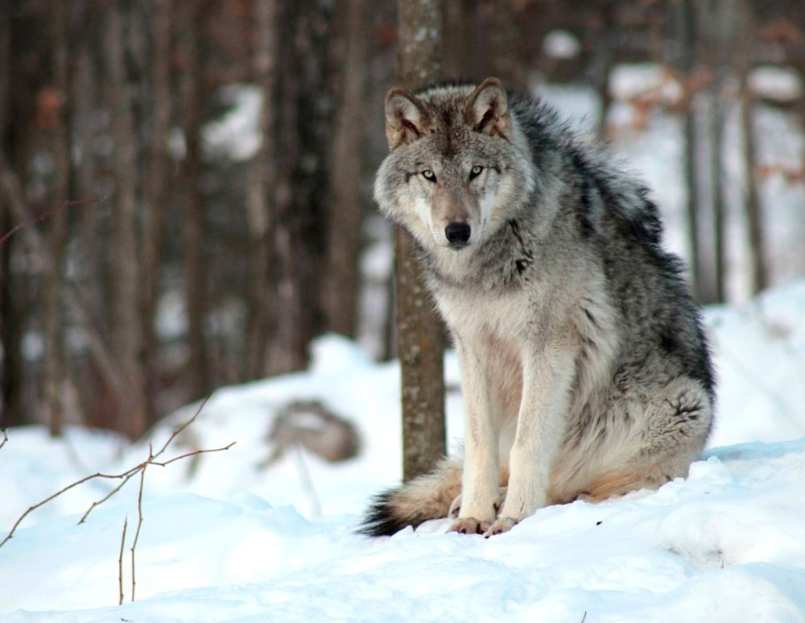
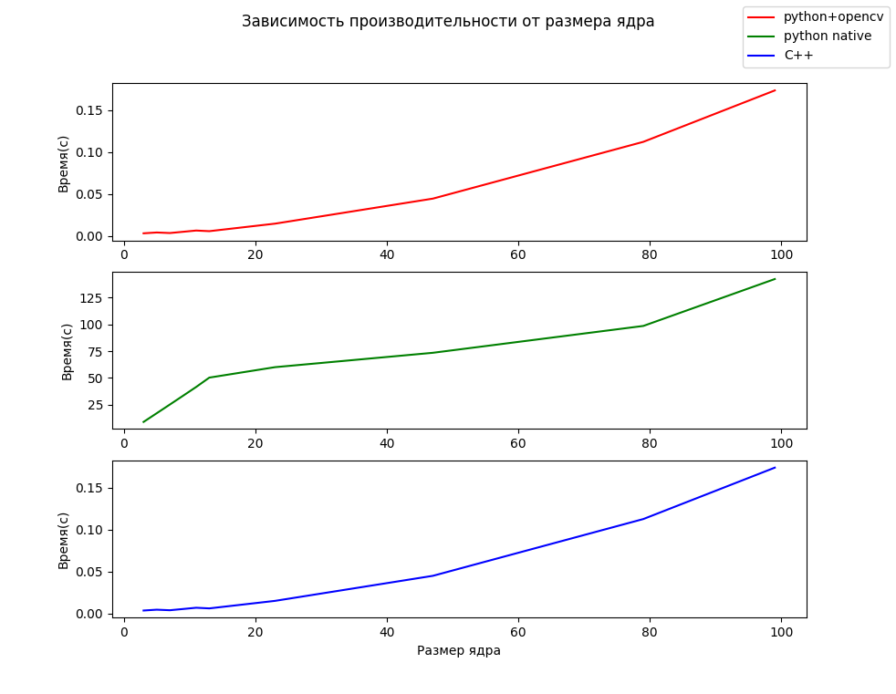

# ЛР1
## Цель работы:
Научиться реализовывать один из простых алгоритмов обработки изображений.

### Вариант 4
Усредняющий фильтр Гаусса. На вход поступает изображение, программа
отрисовывает окно, в которое выводится либо исходное изображение,
либо после усредняющего фильтра (переключение по нажатию клавиши)
- размер ядра должен задавиться как параметр, в отчёте должно быть
приложено исследование зависимости производительности от размера
ядра.

Усредняющий фильтр относится к классу фильтров низких частот. Он может использоваться для уменьшения влияния шума на изображение, однако его применение приводит к размытию изображения и ухудшению его четкости. Фильтр Гаусса 'gaussian' Это также фильтр нижних частот, но, по сравнению с усредняющим фильт ром, он меньше размывает изображения. Центральный элемент маски такого фильтра имеет максимальное значение, что соответствует пику распределения Гаусса.

#Выполнение работы
В данной работе были реализованы три варианта применения фильтра Гаусса к одному и тому же изображению. Первый вариант - использование встроенной функции GaussianBlur opencv2 на python, во втором варианте использовались операции над массивами numpy и третий вариант на С++. Код на С++ собирается с помощью Cmake и запускается из скрипта (main.py) на python. Данный скрипт прменяет фильтр Гаусса к одному изображению тремя разными способами для десяти разных размеров ядер (3, 5, 7, 9, 11, 13, 23, 47, 79, 99). Так же он измеряет время работы алгоритмов и строит графики зависимости времени работы от размера ядра.

Пример использования усредняющего фильтра Гаусса представлен на рисунках ниже (и в папке results).
  
**рис. 1 - Изначальное изображение**  
  
**рис. 2 - Применение фильтра Гаусса**  

  
**рис. 3 - Графики зависимости времени работы алгоритма от размера ядра**  

Как можно заметить с увеличением размера ядра время работы алгоритма увеличивается

## Источники
- https://coderlessons.com/tutorials/akademicheskii/izuchite-opencv/opencv-gaussian-blur
- https://studwood.net/1626075/informatika/maski_filtrov
- http://www.graph.unn.ru/rus/materials/CG/CG04_ImageProcessing2.pdf
