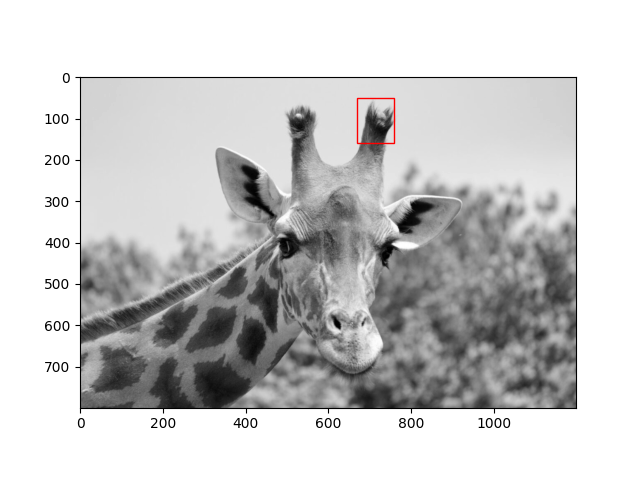
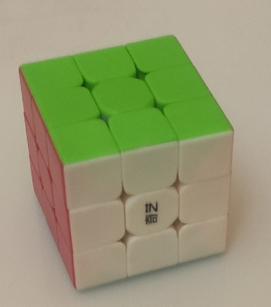

# ЛР2
## Цель работы:
Исследовать простейшие алгоритмы детектирования объектов на изображении.

### 1. Прямой поиск одного изображения на другом (template matching)
*Template matching* — метод, основанный на нахождении места на изображении,
наиболее похожем на шаблон. “Похожесть” изображения задается определенной 
метрикой. То есть, шаблон "накладывается" на изображение, и считается
расхождение между изображением и шаблоном. Положение шаблона, 
при котором это расхождение будет минимальным, и будет означать 
место искомого объекта.

Для реализации этого метода использовался метод ssim(image, template) для оценки соответствия структурного сходства между двумия изображениями.

### 2. Поиск ключевых точек эталона на входном изображении с помощью ORB
ORB представляет собой сочетание детектора ключевых точек FAST и дескриптора BRIEF со многими модификациями для 
повышения производительности.
*Особая (ключевая) точка изображения* – это точка изображения, окрестность которой можно отличить от окрестности любой другой точки 
изображения в некоторой другой окрестности особой точки. В качестве окрестности точки изображения для большинства 
алгоритмов берётся прямоугольное окно, составляющее размер 5x5 пикселей. Процесс определения особых точек достигается 
путём использования детектора и дескриптора.  

После того, как особые точки найдены, вычисляют их дескрипторы, т.е. наборы признаков, характеризующие окрестность 
каждой особой точки.  
*FAST* - метод поиска особых точек, который завоевал большую популярность из-за своей вычислительной эффективности. 
Для принятия решения о том, считать заданную точку **С** особой или нет, в этом методе рассматривается яркость пикселей
на окружности с центром в точке **С** и радиусом 3
*BRIEF* – быстрый эвристический дескриптор, строится из 256 бинарных сравнений между яркостями пикселов на размытом изображении.  

В ORB Предложено сначала вычислять ориентацию особой точки и затем проводить бинарные сравнения уже в соответствие с этой ориентацией. Работает алгоритм так:  

1) Особые точки обнаруживаются при помощи быстрого древовидного FAST на исходном изображении и на нескольких изображениях из пирамиды уменьшенных изображений.  

2) Для обнаруженных точек вычисляется мера Харриса, кандидаты с низким значением меры Харриса отбрасываются.  

3) Вычисляется угол ориентации особой точки. Для этого, сначала вычисляются моменты яркости для окрестности особой точки.
   Всё это авторы назвали «центроид ориентации». В итоге получаем некоторое направление для окрестности особой точки.  

4) Имея угол ориентации особой точки, последовательность точек для бинарных сравнений в дескрипторе BRIEF поворачивается в соответствие с этим углом.  
5) По полученным точкам вычисляется бинарный дескриптор BRIEF.

### Результаты работы

| Шаблон       | Template matching | ORB |
| ------------- |:------------------:| -----:|
||| |
||| |
||| |
||||
||||
||Шаблон не найден||
||Шаблон не найден||
||Шаблон не найден||
||Шаблон не найден||
||Шаблон не найден||

### Заключение

Можно сделать вывод что в случае пиксельного соответствия (искомое изображение являе тся частью входного) Template matching отлично себя показывает и находит искомое изображение всегда. В случае если искомое изображение не было вырезано из того, на котором производится поиск не удалость найти искомое ни в одном случае. 

Метод ORB показал себя хорошо как и на вырезаемых изображениях так и на просто пхожих и ему удавалось определить примерное местоположение объекта. Но в случае если искомое изображение просто вырезано Template matching по понятным причинам оказался точнее с точки зрения выделения области объекта. 

P.S. В вариантах с поисками трех объектов на одном изображении изменялось освещение

### Список использованной литературы
- https://habr.com/ru/company/joom/blog/445354/
- https://habr.com/ru/post/414459/
- https://habr.com/ru/post/244541/
- https://vc.ru/dev/249864-poisk-izobrazheniy-po-fragmentu-s-pomoshchyu-orb
