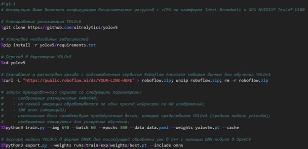

# Дедектор закрытых глаз  
Программа детектирования закрытости/открытости глаз человека

## Цель работы:
Создать прикладную систему компьютерного зрения.  

С помощью обученой модели научиться определять по видеопотку в режим реального времени закрыты или открыты глаза у человека.

## Применение
Данная система может применятся в автомобилях например сигнализировать водителю дальнобойщику когда стоит сделать перерыв на сон. Или на предприятии во избежании аварийных ситуаций из-за невыспавшихся работников.

## Ход работы

### Архитектура нейронной сети

Использованная в данной работе модель нейронной сети YOLOv5 относится к архитектуре One-Stage detector - подход, который предсказывает координаты определённого количества bounding box'ов с результатами классификации и вероятности нахождения объекта, и в дальнейшем корректируя их местоположение.
Сеть скейлит исходное изображение в несколько feature map'ов с использованием skip-connection и прочих архитектурных фишек. Полученные карты признаков приводятся в одно разрешение с помощью апсемплинга и конкатенируются. Затем предсказываются классы и bounding box'ы для объектов, далее для каждого объекта выбирается самый вероятный bounding box с помощью Non-Maximum Suppression.

### Обучение

Далее выбранная модель нейронной сети была обучена на датасете из Roboflow Annotate с помощью облачного сервиса Yandex DataSphere и экспортирована в форматой открытой библиотеки программного обеспечения для построения нейронных сетей глубокого обучения ONNX (Open Neural Network Exchange).

## Результаты

Так же был разработан графический пользовательский интерфейс с помощью фреймворка Qt. Разработанная программа в режим реального времени получая изображении с камеры находить на нем человеческие глаза и детектирует закрыты они или открыты.